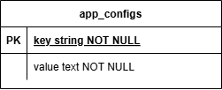

# Custom Agent Assignment System

Sistem ini digunakan untuk mengatur _auto-assignment_ customer ke agent yang aktif dan memiliki load kerja paling ringan menggunakan Qiscus Omnichannel.

---

## Fitur Utama

- Mendengarkan webhook Qiscus dan mengantri customer ke Redis Stream
- Memproses customer berdasarkan prinsip **FIFO**
- Menentukan agent dengan beban kerja paling ringan (API Qiscus)
- Menyesuaikan `max_load` yang diambil dari Redis atau fallback ke Postgres
- Melakukan assign jika memungkinkan, retry jika gagal
- Mendukung dynamic config `max_load` melalui API internal

---

## Flowchart System


## Sequence Diagram


## ERD - Postgres



## Getting Started

This guide will walk you through setting up and running the Auto Agent Assignment system on your local environment.

---

## Requirements

- Go
- Git
- PostgreSQL
- Redis
- Postman (for testing APIs)

---

## Project Setup

### 1. Clone the Repository

```bash
git clone https://github.com/agiladis/custom-agent-allocation.git
cd custom-agent-allocation
```

### 2. Configure Environment

create a .env file by copying the example:

```bash
cp .env.example .env
```

### 3. Initialize the Database

create database according to name in env

### 5. Install Go Dependencies

```bash
go mod tidy
```

### 5. Build & Run the Application

```bash
go run cmd/main/main.go
```

## Import Postman Collection

- Import assets\postman\QISCUS - Custom Agent Alocation.postman_collection.json into Postman
- Use assets\postman\Qiscus -Custom Agent Alocation.postman_environment.json for environment variables
- Run requests for:
  - GET /api/v1/config/max-load
  - PUT /api/v1/config/max-load
  - POST /api/v1/webhook/custom-agent-allocation
